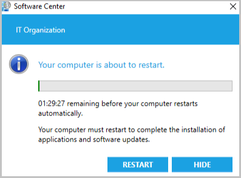
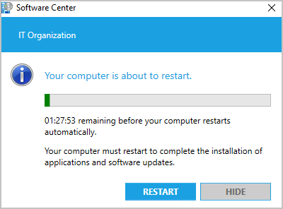
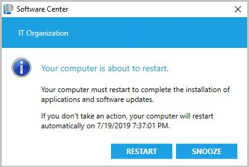

# Device restart notifications in Configuration Manager

*Applies to: System Center Configuration Manager (current branch)*

The notifications a user receives for a pending device restart can vary depending on [Computer restart client settings](/sccm/core/clients/deploy/about-client-settings#computer-restart) and which version of Configuration Manager is being used. This article helps admins determine what the user experience is for pending device restart notifications.

>[!NOTE]
> - This article focuses on client settings found in Configuration Manager version 1902 and version 1906.

## Deployment types for restart notifications

The [Computer restart client settings](/sccm/core/clients/deploy/about-client-settings#computer-restart) change the user experience for all required deployments that require a restart of the following types:

- [Application](/sccm/apps/deploy-use/deploy-applications)
- [Task sequence](/sccm/osd/deploy-use/manage-task-sequences-to-automate-tasks#BKMK_DeployTS)
- [Software update](/sccm/sum/deploy-use/deploy-software-updates)

## Restart notification types

When a restart is required, the end user is given notification of the upcoming restart. There are four general notifications users can receive:

**Toast notification** informing you a restart is needed. The information in the toast notification can be different depending on which version of Configuration Manager you're running. This type of notification is native to the Windows OS and you may also see third-party software using this type of notification.

Software Center notification with a snooze option showing time remaining before a restart is enforced. The message may be different depending on your version of Configuration Manager.

Software Center final countdown notification that can't be closed by the user. The snooze button is grayed out.

If the user proactively installs required software that needs restart before the deadline occurs, they'll see a different notification. The following notification occurs when both the user experience setting allows notifications and you don't use toast notifications for the deployment. For more information about configuring these settings, see [Deployment **User Experience** settings](/sccm/apps/deploy-use/deploy-applications#bkmk_deploy-ux) and [User notifications for required deployments](/sccm/apps/deploy-use/deploy-applications#bkmk_notify).

- When you don't use toast notifications, the dialog for software marked as **Available** is similar to proactively installed software.

  - For **Available** software, the notification doesn't have a deadline for the restart and the user can choose their own snooze interval. For more information, see [Approval settings](/sccm/apps/deploy-use/deploy-applications#bkmk_approval).

    

## Device restart notifications in version 1902

<!--3555947-->
Sometimes users don't see the Windows toast notification about a restart or required deployment. Then they don't see the experience to snooze the reminder. This behavior can lead to a poor user experience when the client reaches a deadline.

Starting in version 1902, when software changes are required or deployments need a restart, you have the option of using a more intrusive dialog window.

In the [Computer Restart](/sccm/core/clients/deploy/about-client-settings#computer-restart) group of client settings, enable the following option: **When a deployment requires a restart, show a dialog window to the user instead of a toast notification**.  

Configuring this client setting changes the user experience for all required deployments that require a restart from toast notifications:

  

To the more intrusive Software Center dialog window:

If the user didn't restart their device after the installation, then they'll get a notification as a reminder. This temporary reminder will appear to the user based on the client setting: **Display a temporary notification to the user that indicates the interval before the user is logged off or the computer restarts (minutes)**. This setting is the overall time the user has to restart the machine before a restart is forced.

- Temporary notification when you use toast notifications:

  

- Temporary notification when you use Software Center dialog window, not toast:

  

If the user doesn't restart after the temporary notification, they'll be given the final countdown notification that they can't close. The timing of when the final notification appears is based on the client setting: **Display a dialog box that the user cannot close, which displays the countdown interval before the user is logged off or the computer restarts (minutes)**. For instance, if the setting is 60, then an hour before a reboot is forced, the final notification appears to the user:

The following settings must be shorter in duration than the shortest [maintenance window](/sccm/core/clients/manage/collections/use-maintenance-windows) applied to the computer:

- **Display a temporary notification to the user that indicates the interval before the user is logged off or the computer restarts (minutes)**
- **Display a dialog box that the user cannot close, which displays the countdown interval before the user is logged off or the computer restarts (minutes)**

> [!IMPORTANT]
> In Configuration Manager 1902, under certain circumstances, the dialog box won't replace toast notifications. To resolve this issue, install the [update rollup for Configuration Manager version 1902](https://support.microsoft.com/help/4500571/update-rollup-for-configuration-manager-current-branch-1902). <!--4404715-->

## Device restart notifications starting in version 1906
<!--3976435-->
Some admins prefer frequent restart notifications and a short time frame for allowing restarts to be postponed. Other admins allow users to postpone a restart for longer periods of time and want users to be notified of the pending restart infrequently. Configuration Manager version 1906 gives an admin additional control over the timing and frequency of restart notifications. The following items were introduced in 1906 to give the admin greater control:

- **Specify the snooze duration for computer restart countdown notifications (minutes)** was added to [Computer restart client settings](/sccm/core/clients/deploy/about-client-settings#computer-restart).
- The maximum value for **Display a temporary notification to the user that indicates the interval before the user is logged off or the computer restarts (minutes)** increased from 1440 minutes (24 hours) to 20160 minutes (two weeks).
- The user won't see a progress bar in the restart notification until the pending restart is less than 24 hours away.

### Notifications when required software is installed at or after the deadline

When required software is installed at or after the deadline, your users will see notifications depending on what client settings you selected.

If the setting **When a deployment requires a restart, show a dialog window to the user instead of a toast notification** is set to:

- **No** - Toast notifications are used until the final countdown notification is reached.
- **Yes** - A Software Center notification is seen.
  - If the restart is greater than 24 hours away, an estimated restart time is seen. The timing of this notification is based on the setting: **Display a temporary notification to the user that indicates the interval before the user is logged off or the computer restarts (minutes)**.

     

  - If the restart is less than 24 hours away, a progress bar is seen. The timing of this notification is based on the setting: **Display a temporary notification to the user that indicates the interval before the user is logged off or the computer restarts (minutes)**

     

If the user selects the **Snooze** button, another temporary notification will occur after the snooze period elapses, assuming they haven't yet reached the final countdown. The timing of the next notification is based on the setting: **Specify the snooze duration for computer restart countdown notifications (hours)**. If the user selects **Snooze** and your snooze interval is one hour, then the user will be notified again in 60 minutes assuming they haven't yet reached the final countdown.

When the final countdown is reached, the user is given a notification they can't close. The progress bar is in red and the user can't hit **Snooze**.

### The user proactively installs before the deadline

If the user proactively installs required software that needs restart before the deadline occurs, they'll see a different notification. For more information about configuring these settings, see [Deployment **User Experience** settings](/sccm/apps/deploy-use/deploy-applications#bkmk_deploy-ux) and [User notifications for required deployments](/sccm/apps/deploy-use/deploy-applications#bkmk_notify). 

The following notification occurs when both the user experience setting allows notifications and you don't use toast notifications for the deployment:

Once the deadline for the software is reached, the [Notifications when required software is installed at or after the deadline](#notifications-when-required-software-is-installed-at-or-after-the-deadline) behavior is followed.

## Log files

Use the **RebootCoordinator.log** and **SCNotify.log** for troubleshooting device restarts. You may also have to use additional client [log files](/sccm/core/plan-design/hierarchy/log-files) based on the type of deployment used.

## Next steps

- [Introduction application management](/sccm/apps/understand/introduction-to-application-management)
- [Introduction to operating system deployment](/sccm/osd/understand/introduction-to-operating-system-deployment)
- [Introduction to software updates management](/sccm/sum/understand/software-updates-introduction)
