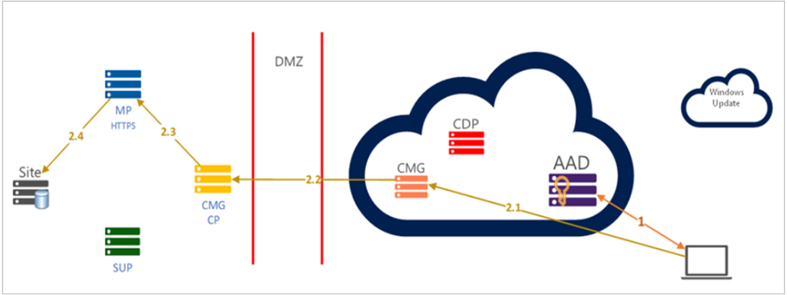
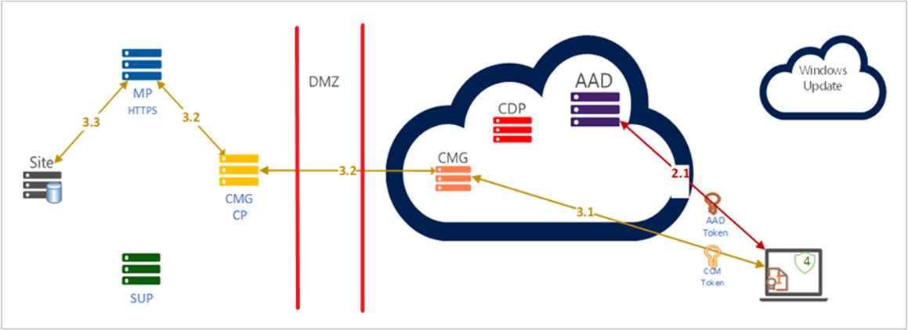

# Azure AD authentication workflow

*Applies to: System Center Configuration Manager (Current Branch)*

This article is a technical reference for the Configuration Manager client installation process on a Windows 10 device that's joined to Azure Active Directory (Azure AD). It details the workflow process for the device authentication and client installation.  
 

## Azure AD token request workflow

  

### 1. Azure AD token request

A Windows 10 Azure AD domain-joined client uses Azure AD parameters to request a token. The following entries are logged in **ccmsetup.log**:

- Request Azure AD device token:

    ``` Log
    Getting AAD (device) token with: ClientId = 22ed38d9-XXXX-4036-XXXX-a98452fda4fc, ResourceUrl = https://ConfigMgrService, AccountId = https://login.microsoftonline.com/common/oauth2/token
    ```

- If it can't get a device token, it requests an Azure AD user token:

    ``` Log
    Getting AAD (user) token with: ClientId = f1f9b14e-XXXX-4f17-XXXX-2593f6eee91e, ResourceUrl = https://ConfigMgrService, AccountId = X49FC29A-ECE3-XXX-A3C1-XXXXXXF035A6E
    ```

> [!NOTE]
> A client should get a workplace join (WPJ) certificate when it joins Azure AD. If a workplace join certificate isn't found, the client doesn't try to create the request using the Security Token Service communication channel (CCM_STS). This behavior is because the client can't add an Azure AD token to the request. The device typically doesn't have this certificate when the client isn't properly joined to Azure AD.
>
> Additionally, if the token isn't valid, the cloud management gateway (CMG) doesn't forward the request to the internal site roles. The token can be invalid if the tenant isn't registered as a cloud management service in Configuration Manager.


### 2. Configuration Manager client token request

Once the client has an Azure AD token, it requests a Configuration Manager client (CCM) token.

The following entries are logged in **ccmsetup.log** of the CMG virtual machine:

``` Log
Getting CCM Token from STS server 'CloudManagementGateway.cloudapp.net/CCM_PROXY_MUTUALAUTH/XXXXXX037938216'
Getting CCM Token from https://CloudManagementGateway.cloudapp.net/CCM_PROXY_MUTUALAUTH/XXXXXX037938216/CCM_STS
```

#### 2.1 CMG gets request

The following entries are logged in **IIS.log**:

``` Log
RD0003FF74XX2 10.0.0.4 GET /CCM_STS - 443 - HTTP/1.1 python-requests/2.20.0 - - 13.95.234.44 404 0 2 1477 154 15
```

#### 2.2 CMG forwards request to CMG connection point

The following entries are logged in **CMGService.log**:

``` Log
RequestUri: /CCM_PROXY_SERVERAUTH/XXXXXX037938216/CCM_STS  RequestCount: 769  RequestSize: 1081595 Bytes  ResponseCount: 769     ResponseSize: 36143 Bytes  AverageElapsedTime: 3945 ms
```

#### 2.3 CMG connection point transforms CMG client request to management point client request

The following entries are logged in **SMS_CLOUD_PROXYCONNECTOR.log**:

``` Log
MessageID: 3087bd34-b82c-4950-b972-e82bb0fb8385 RequestURI: https://MP.MYCORP.COM/CCM_STS EndpointName: CCM_STS ResponseHeader: HTTP/1.1 200 OK ~~ ResponseBodySize: 0 ElapsedTime: 2 ms
```

#### 2.4 Management point verifies user token in site database

The following entries are logged in **CCM_STS.log**:

``` Log
Validated AAD token. TokenType: Device TenantId: XXXXe388-XXXX-485c-XXXX-e8e4eb41XXXX UserId: 00000000-0000-0000-0000-000000000000 DeviceId: 0XXXXX80-77XX-4XXa-X63X-67XXXXX64bb7 OnPrem_UserSid:  OnPrem_DeviceSid:

Return token to client, token type: UDA, hierarchyId: XXXX4f9c-XXXX-46a5-XXXX-7612c324XXXX, userId: 00000000-0000-0000-0000-000000000000, deviceId: GUID:XXXXaee9-cXXc-4ccd-XXXX-f1417d81XXX
```


## Content location request

Once the client gets a response with the CCM token, it caches and uses it to request site information and content location through the CMG. The following entries are logged in **ccmsetup.log**:

``` Log
Cached encrypted token for 'S-1-5-18'. Will expire at '00/99/2999 00:00:00'
Sending location request to 'CloudManagementGateway.cloudapp.net/CCM_PROXY_MUTUALAUTH/XXXXXX037938216' with payload '< Request >
Appending CCM Token to the header.
```


## Client installation

The device downloads the client content and starts the installation.

### Communication validation

- CMG validates client token via CMG, CMG connection point and HTTP(S), and management point database request.
- Client verifies CMG service certificate or management certificate
- PKI for CMG service certificate: Client requires root certificate authority (CA) of the CMG certificate on local store
- Third-party CMG service certificate: Clients automatically validate a certificate with its root CA published on the internet


## Common issues

- Root CA not present
- CRL check enabled: publish CRL on internet, or use the **/NoCRLcheck** option in command line
- WPJ certificate not found: client is registered with Azure AD, but not joined to Azure AD

Using /NoCRLCheck is only good for ccmsetup bootstrap. For the clients to be fully functional, you should publish the CRL on the internet. As a workaround, you can disable the CRL check on the site's client communication configuration. Otherwise, after the security settings are refreshed by location service, the clients stop communicating with the server.


## Client registration

  

### 1. Configuration Manager client request registration

The following entries are logged in **ClientIDManagerStartup.log**:

``` Log
[RegTask] - Client is not registered. Sending registration request for GUID:1XXXXXEF-5XX8-4XX3-XEDX-XXXFBFF78XXX ...
Registering client using AAD auth.
```

### 2. Configuration Manager request Azure AD token to register client

The following entries are logged in **ADALOperationProvider.log**:

``` Log
Getting AAD (user) token with: ClientId = f1f9b14e-XXXX-4f17-XXXX-2593f6eee91e, ResourceUrl = https://ConfigMgrService, AccountId = X49FC29A-ECE3-XXX-A3C1-XXXXXXF035A6E
Retrieved AAD token for AAD user '00000000-0000-0000-0000-000000000000'
```

#### 2.1 Configuration Manager client is registered  

The following entries are logged in **ClientIDManagerStartup.log**:

``` Log
[RegTask] - Client is registered. Server assigned ClientID is GUID:1XXXXXEF-5XX8-4XX3-XEDX-XXXFBFF78XXX. Approval status 3
```

> [!NOTE]  
> During client registration, certificate validation always runs. This process happens even if you're using the Azure AD authentication method to register the client.


### 3. Configuration Manager client token request

Once the site registers the client, the client requests a CCM token. The CCM token is encrypted for the local System account (S-1-5-18) and cached for eight hours. After eight hours, the token expires, and the client requests token renewal.

The following entries are logged in **ClientIDManagerStartup.log**:

``` Log
Getting CCM Token from STS server 'MP.MYCORP.COM'
Getting CCM Token from https://MP.MYCORP.COM/CCM_STS
...
Cached encrypted token for 'S-1-5-18'. Will expire at 'XX/XX/XX XX:XX:XX'
```

#### 3.1 CMG gets request

The following entries are logged in **IIS.log**:

``` Log
RD0003FF74XX2 10.0.0.4 GET /CCM_STS - 443 - HTTP/1.1 python-requests/2.20.0 - - 13.95.234.44 404 0 2 1477 154 15
```

#### 3.2 CMG forwards request to CMG connection point

The following entries are logged in **CMGService.log**:

``` Log
RequestUri: /CCM_PROXY_SERVERAUTH/XXXXXX037938216/CCM_STS  RequestCount: 769  RequestSize: 1081595 Bytes  ResponseCount: 769     ResponseSize: 36143 Bytes  AverageElapsedTime: 3945 ms
```

#### 3.3 CMG connection point transforms CMG client request to management point client request

The following entries are logged in **SMS_CLOUD_PROXYCONNECTOR.log**:

``` Log
MessageID: 3087bd34-b82c-4950-b972-e82bb0fb8385 RequestURI: https://MP.MYCORP.COM/CCM_STS EndpointName: CCM_STS ResponseHeader: HTTP/1.1 200 OK ~~ ResponseBodySize: 0 ElapsedTime: 2 ms
```

#### 3.4 Management point verifies user token in site database

The following entries are logged in **CCM_STS.log**:

``` Log
Validated AAD token. TokenType: Device TenantId: XXXXe388-XXXX-485c-XXXX-e8e4eb41XXXX UserId: 00000000-0000-0000-0000-000000000000 DeviceId: 0XXXXX80-77XX-4XXa-X63X-67XXXXX64bb7 OnPrem_UserSid:  OnPrem_DeviceSid:

Return token to client, token type: UDA, hierarchyId: XXXX4f9c-XXXX-46a5-XXXX-7612c324XXXX, userId: 00000000-0000-0000-0000-000000000000, deviceId: GUID:XXXXaee9-cXXc-4ccd-XXXX-f1417d81XXX
```
