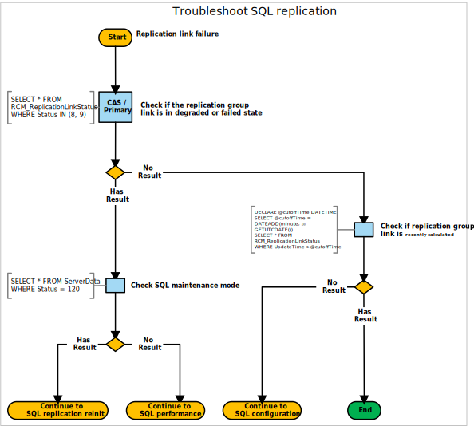

# SQL replication

In a multi-site hierarchy, Configuration Manager uses SQL replication to transfer data between sites. For more information, see [Database replication](/sccm/core/plan-design/hierarchy/database-replication).

Use the following diagram to start troubleshooting SQL replication when a link fails:



## Queries

This diagram uses the following queries:

### Check if the replication group link is in degraded or failed state

```sql
SELECT * FROM RCM_ReplicationLinkStatus
WHERE Status IN (8, 9)
```

### Check if replication group link is recently calculated

```sql
DECLARE @cutoffTime DATETIME
SELECT @cutoffTime = DATEADD(minute, -30, GETUTCDATE())
SELECT * FROM RCM_ReplicationLinkStatus
WHERE UpdateTime >@cutoffTime
```

### Check SQL maintenance mode

```sql
SELECT * FROM ServerData
WHERE Status = 120
```

## Next steps

- [SQL replication reinitialization (reinit)](/sccm/core/servers/manage/replication/sql-replication-reinit)
- [SQL performance](/sccm/core/servers/manage/replication/sql-performance)
- [SQL configuration](/sccm/core/servers/manage/replication/sql-configuration)
